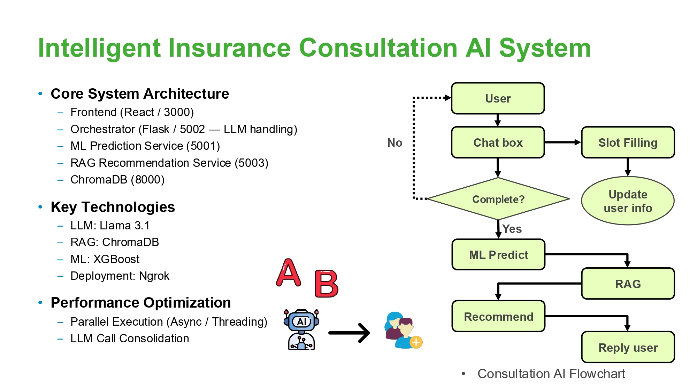

# Intelligent Insurance Consultation AI System

An end-to-end **AI-powered insurance consultation system** that combines:

* **LLM-based slot filling & conversation orchestration**
* **ML-based insurance premium prediction (XGBoost)**
* **RAG-based product recommendation using ChromaDB**

This project is designed as a **microservice-based architecture** and is suitable as a public GitHub portfolio project.

---

## ✨ Key Features

* **Conversational Insurance Consultation**
  LLM-driven conversation flow with structured slot filling and explicit state management.

* **Premium Prediction (ML Service)**
  Feature-engineered XGBoost model exposed via a RESTful Flask service for real-time inference.

* **Product Recommendation (RAG Service)**
  Embedding-based retrieval using ChromaDB with prompt-grounded product explanations.

* **Scalable Microservice Design**
  Clear separation of concerns across LLM orchestration, ML inference, and retrieval services.

---

## 🏗️ System Architecture



The system is designed to decouple **LLM orchestration**, **ML inference**, and **retrieval logic**, allowing each component to scale, evolve, and be maintained independently.

**Services Overview**:

| Service      | Description                       | Port |
| ------------ | --------------------------------- | ---- |
| Frontend     | React-based UI                    | 3000 |
| Orchestrator | LLM orchestration & slot filling  | 5002 |
| ML Service   | Premium prediction (XGBoost)      | 5001 |
| RAG Service  | Product recommendation (ChromaDB) | 5003 |
| ChromaDB     | Vector database                   | 8000 |

---

## 📂 Project Structure

```
.
├── frontend/          # React frontend
├── orchestrator/      # LLM orchestration service (Flask)
├── ml-service/        # ML prediction service (Flask + XGBoost)
├── rag-service/       # RAG recommendation service (Flask + ChromaDB)
├── data/              # Schema & synthetic sample data (no real products)
├── dataset/           # ML training dataset (not redistributed)
├── models/            # Trained ML models
├── scripts/           # Utility & test scripts
├── images/            # Architecture & demo screenshots
└── README.md
```

---

## 🧰 Tech Stack

* **Language**: Python 3.12
* **LLM**: Llama 3.1 (via local or API-based inference)
* **RAG**: ChromaDB + Sentence Transformers
* **ML**: XGBoost, scikit-learn
* **Backend**: Flask
* **Frontend**: React
* **Env Management**: `uv` (recommended)

---

## 📊 Dataset

The ML service is trained using the following publicly available dataset:

* **Name**: Medical Insurance Cost Dataset
* **Description**: Predicts health insurance charges based on demographic and lifestyle factors
* **Source**: Kaggle
* **URL**: [https://www.kaggle.com/datasets/mosapabdelghany/medical-insurance-cost-dataset](https://www.kaggle.com/datasets/mosapabdelghany/medical-insurance-cost-dataset)

The raw dataset file is **not included** in this repository.
Users can download it directly from the original source and place it under:

```
/dataset/insurance.csv
```

This approach respects the original dataset license and keeps the repository lightweight.

---

## ⚙️ Environment Setup (Recommended)

This project **recommends using `uv`** for fast and clean dependency management.

### 1️⃣ Create Virtual Environment

```bash
uv venv .venv --python 3.12
source .venv/bin/activate
```

### 2️⃣ Install Dependencies

```bash
uv pip install -r ml-service/requirements.txt
uv pip install -r rag-service/requirements.txt
uv pip install -r orchestrator/requirements.txt
```

---

## ▶️ Run Services

> Open separate terminals for each service.

### ML Service (Premium Prediction)

```bash
cd ml-service
python flask_predict_price.py
```

### RAG Service (Recommendation)

```bash
cd rag-service
python recommendation_service.py
```

### Orchestrator (LLM & Conversation)

```bash
cd orchestrator
python chat_with_llama.py
```

### Frontend

```bash
cd frontend
npm install
npm start
```

---

## 📊 Demo

Sample screenshots and results can be found in the `images/` directory, including:

* Slot filling conversation flow
* Premium prediction results
* RAG-based recommendation outputs

---

## 📌 Notes

* This repository **does not include runtime artifacts** such as virtual environments or ChromaDB persistence directories.
* `torch` is intentionally **not version-pinned** to support different OS / CPU / CUDA environments.
* The trained ML model is provided for demo purposes.

---

## 🗂️ Data Disclaimer

The repository does **not include real insurance product data**.

Any sample data used by the RAG pipeline is either:

* Synthetic (fictional) data, or
* User-provided at runtime

This design ensures compliance with data usage policies while focusing on system architecture, retrieval logic, and model integration.

---

## 🚀 Future Improvements

* Docker & docker-compose support
* Async orchestration between ML and RAG services
* Streaming LLM responses
* Production-grade logging & monitoring

---

## 📜 License

This project is released for **educational and portfolio purposes only** and is not intended for direct production use.
